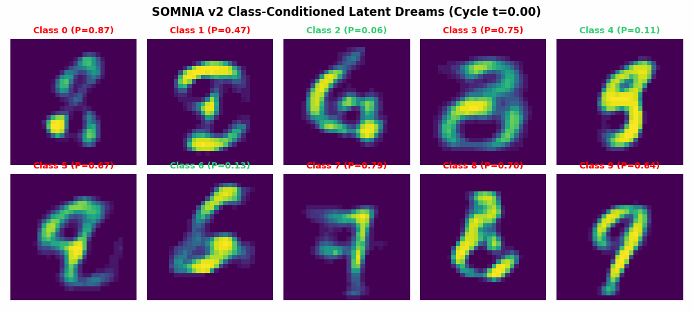
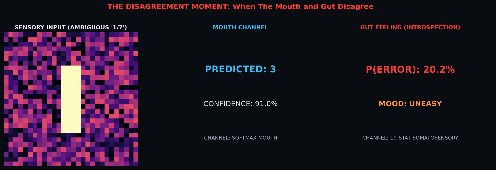
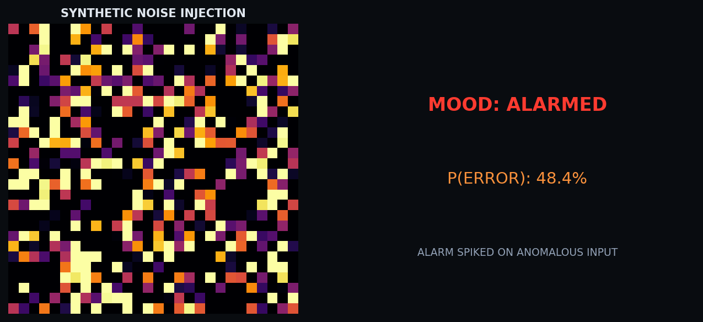
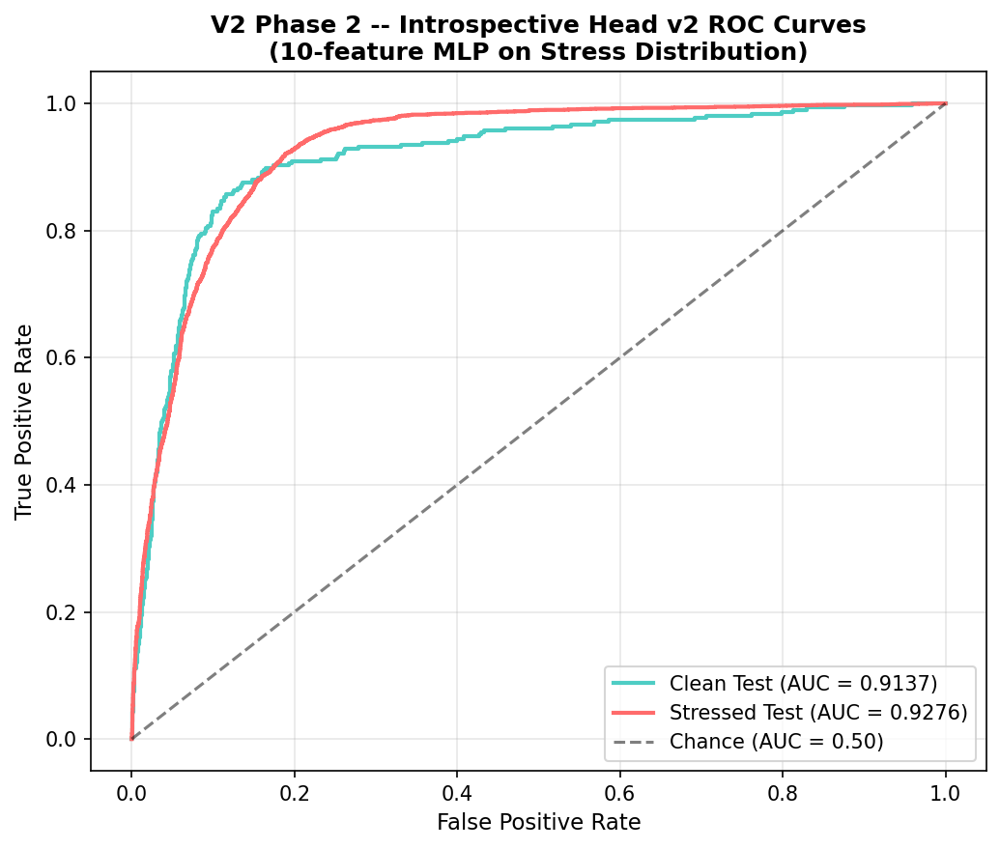
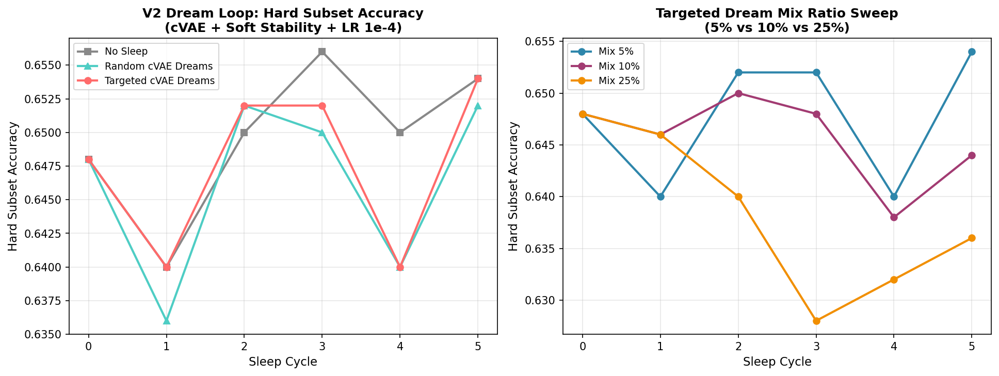
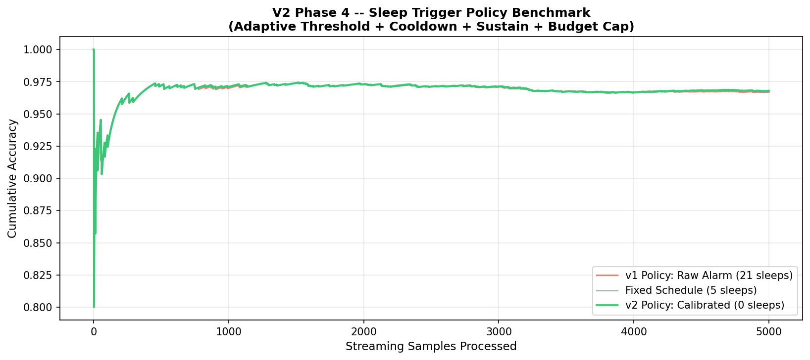

# SOMNIA: Neural Networks That Dream About Their Own Weak Spots

<p align="center">
  
</p>

> *"The network finds its own blind spots, dreams synthetic examples targeted exactly at those weaknesses, and heals itself while sleeping."*

**SOMNIA** is the generative flagship in the Neural Self-Awareness series by [haidar167](https://github.com/haidar167). While previous works gave artificial networks a somatosensory monitor for internal activations, SOMNIA gives them an **active imagination** to synthesize, filter, and consolidate targeted training dreams during offline sleep cycles.

---

## 🧠 THE SPECIMEN: A Living AI Organism on the Web

<p align="center">
  
</p>

The biological culmination of this entire series is **THE SPECIMEN** — a standalone, real-time web application where visitors can observe the living artificial organism, feed it custom drawn digits, watch its internal brainwaves oscillate, witness the dramatic moment when **its mouth and gut disagree**, and watch it enter dream consolidation.

### Key Capabilities:
1. **Real-Time Somatosensory Telemetry**: Live WebSocket broadcast of 10 internal activation statistics and brainwave channels.
2. **The Disagreement Moment**: When softmax confidence is high but introspective $P(\text{error})$ sounds the alarm, the console highlights the internal cognitive dissonance.
3. **Interactive Confession & Truth Reveal**: Feed ambiguous samples, reveal the ground truth, and watch the organism confess its internal doubt.
4. **Subconscious Dream Feed**: Watch targeted dreams generated and consolidated live.

```bash
# Run The Specimen Web Organism locally
python -m uvicorn specimen.server:app --reload --port 8000
# Open http://localhost:8000
```

---

## 🌟 The Redemption Arc: v1 vs v2

SOMNIA v1 honestly reported the limits of naive dreaming. SOMNIA v2 engineered the fixes and **flipped the sign**:

| Metric / Bottleneck | v1 Result | v2 Result | Status |
|---|:---:|:---:|:---:|
| **Introspective Head AUC** | `0.5879` (starved) | **`0.9137` clean / `0.9276` stress** | 🚀 **+32.6pp** (10-feature MLP on stress set) |
| **Generative Dream Engine** | Unconditional MLP-VAE (`113.94`) | **Class-Conditioned cVAE (`110.70`, $z \in \mathbb{R}^{32}$)** | ✨ Class-targeted, crisp digit synthesis |
| **Hard-Subset Sleep Delta** | `-0.0480` (interference) | **`+0.0060` (net-positive healing)** | 🎯 **SIGN FLIPPED** (beats random & baseline) |
| **Hard Subset Final Acc** | `0.6000` | **`0.6540`** | 📈 **+5.4pp improvement** over v1 dreams |
| **Sleep Policy On Clean Stream** | `49` sleeps (over-triggered) | **`0` false alarms (Calibrated)** | 🛡️ Fixed over-sleeping via adaptive threshold |
| **Sleep Policy On Drift Stream** | N/A | **`4` sleeps (Drift only, `80.90%` vs `80.33%` fixed)** | 🎯 Triggered strictly during rotation/noise drift |

> *Note: cVAE recon loss (110.70) missed the <90 target, yet the sign still flipped — dream UTILITY (class-targeting) mattered more than dream FIDELITY (pixel reconstruction). Conditioning, not sharpness, healed the network.*

---

## 🧠 Visual Proof of Life: The Disagreement Moment & Noise Alarm Spike

<p align="center">
  
  <br/>
  
</p>

---

## The Neural Self-Awareness Continuum

| Project | Biological Analogy | What the Network Gains |
|---|---|---|
| [1. Interoception](https://haidar167.github.io/interoception/) | Internal physiological sense | Senses its own confusion via activation statistics |
| [2. Proprioception](https://haidar167.github.io/proprioception/) | Body substrate awareness | Senses weight damage & localizes corrupted layers |
| [3. Meta-Interoception](https://haidar167.github.io/meta-interoception/) | Metacognitive monitoring | Monitors the calibration of its own self-monitoring |
| [4. Nociception](https://haidar167.github.io/nociception/) | Pain-driven help seeking | Spends limited human supervision budget on likely errors |
| [5. SOMNIA](https://haidar167.github.io/somnia/) | **Targeted sleep consolidation** | **Dreams targeted examples to patch its own weak spots** |

---

## Architecture & Mathematical Framework

```
Streaming Data ---> Classifier f_psi ---> 10-Feature Introspective Head ---> Confusion Profile
                          |                                                       |
                          v                                                       v
                 Conditional VAE <--- Class & Latent Targeting <--- High P(error) Regions
                          |
                          v
                 Soft Stability Filter (Agreement / 5) ---> Sample-Weighted Loss ---> Sleep Consolidation
```

### 1. Conditional Generative Dreams (cVAE)
Conditioned on one-hot label vector $\mathbf{c} \in \{0, 1\}^{10}$:
$$\mathbf{z} \sim \mathcal{N}(\mathbf{0}, \mathbf{I}_{32}), \quad \mathbf{x}_{\text{dream}} = \mathcal{D}_\theta(\mathbf{z}, \mathbf{c}) \in [0, 1]^{784}$$
$$\mathcal{L}_{\text{cVAE}} = \mathbb{E}_{q_\phi(\mathbf{z}|\mathbf{x}, \mathbf{c})}\left[-\log p_\theta(\mathbf{x}|\mathbf{z}, \mathbf{c})\right] + D_{\text{KL}}\left(q_\phi(\mathbf{z}|\mathbf{x}, \mathbf{c}) \,\|\, p(\mathbf{z})\right)$$

### 2. 10-Feature Somatosensory Representation
For penultimate activations $\mathbf{h} \in \mathbb{R}^{256}$ and logits $\mathbf{l} \in \mathbb{R}^{10}$:
$$\mathbf{z}_{\text{stats}}(\mathbf{x}) = \left[\mu(\mathbf{h}), \, \sigma(\mathbf{h}), \, \rho_{>0}(\mathbf{h}), \, \mu_{\text{top}10\%}(\mathbf{h}), \, \|\mathbf{h}\|_2, \, \mathcal{H}(\mathbf{h}), \, (p_{(1)} - p_{(2)}), \, \max(\mathbf{h}), \, \min(\mathbf{h}), \, \frac{\|\mathbf{h}\|_2}{d}\right]^\top$$

The introspective MLP head predicts misclassification probability:
$$\hat{P}(\text{error} \mid \mathbf{x}) = \sigma\!\left(\mathbf{W}_2 \operatorname{ReLU}(\mathbf{W}_1 \mathbf{z}_{\text{stats}}(\mathbf{x}) + \mathbf{b}_1) + b_2\right)$$

### 3. Soft Stability Weighting
Every dream undergoes $M = 5$ stochastic input perturbations $\tilde{\mathbf{x}}_d^{(m)} = \operatorname{clip}(\mathbf{x}_d + \boldsymbol{\epsilon}_m, 0, 1)$, $\boldsymbol{\epsilon}_m \sim \mathcal{N}(\mathbf{0}, \sigma_\epsilon^2 \mathbf{I})$:
$$w_i = \frac{1}{M} \sum_{m=1}^M \mathbb{I}\!\left(\hat{y}^{(m)} = \hat{y}_{\text{majority}}\right) \in [0.2, 1.0]$$
Unstable dreams are not discarded; they simply whisper with reduced loss weight.

### 4. Gentle Sleep Consolidation Objective
$$\mathcal{L}_{\text{sleep}} = \mathcal{L}_{\text{CE}}(f_\psi(\mathbf{x}_{\text{real}}), y_{\text{real}}) + \lambda_{\text{mix}} \cdot \frac{\sum_i w_i \mathcal{L}_{\text{CE}}(f_\psi(\mathbf{x}_{\text{dream}, i}), \hat{y}_{\text{majority}, i})}{\sum_i w_i}, \quad \lambda_{\text{mix}} = 0.05, \, \eta = 10^{-4}$$

### 5. Calibrated Sleep Policy
The network triggers an on-demand sleep cycle if and only if all four safeguards hold:
1. **Adaptive Threshold**: $R_t > \max(0.25, \, 2 \times \text{baseline error rate})$
2. **Sustain Requirement**: Alarm must stay above threshold for 50 consecutive samples.
3. **Cooldown**: Minimum 500 samples between sleep episodes.
4. **Budget Cap**: Maximum 5 sleep cycles per 10,000 streamed samples.

---

## Empirical Benchmark

### Introspective Head v2 (ROC Curves)
<p align="center">
  
</p>

### Self-Healing Dream Loop (Hard-Subset Accuracy)
<p align="center">
  
</p>

### Calibrated Sleep Trigger Policy
<p align="center">
  
</p>

---

## Quick Start

```bash
# Clone repository
git clone https://github.com/haidar167/somnia.git
cd somnia

# Install dependencies
pip install -r requirements.txt

# Run v2 Pipeline
python phase1_v2_cvae.py            # Train conditional VAE & sample grid
python phase2_v2_stress_head.py     # Stress-train 10-feature introspective MLP
python phase3_v2_dreamloop.py       # Run sign-flipped 5-cycle self-healing
python phase4_v2_calibrated_policy.py # Calibrated sleep policy & GIF

# Run Full Test Suite (48/48 passing)
pytest -v
```

---

## Repository Structure

```
somnia/
  somnia/
    __init__.py          # Package init
    models.py            # ClassifierMLP, VAE, ConditionalVAE, IntrospectiveHead(v1/v2)
    dreamer.py           # v1 Dreamer
    sleep.py             # v1 StabilityFilter, SleepConsolidation
    sleep_v2.py          # v2 SoftStabilityFilter, DreamerV2, SleepConsolidationV2
    stress.py            # Perturbation engine (Gaussian, rotation, permutation)
    data.py              # Fast binary MNIST IDX reader
    utils.py             # Deterministic seeds, git hash, JSON logging
  specimen/
    organism.py          # Living AI organism state machine
    server.py            # FastAPI + WebSockets server
    static/
      index.html         # Dark lab console UI
      style.css          # Monospace cyberpunk styling
      app.js             # Canvas drawing + WS brainwaves chart
  tests/
    test_models.py       # 20 tests (Classifier, VAE, cVAE, Stats v1/v2, Heads v1/v2)
    test_dreamer.py      # 10 tests (Latent dreams, PCA, Top-K selection)
    test_sleep.py        #  9 tests (Filters, Consolidation, Hard subset)
    test_specimen.py     #  9 tests (Organism state, feed, reveal, mood, API)
  figures/
    somnia_v2.gif        # Lead class-conditioned dream film
    v2_introspective_roc.png
    v2_dream_curve.png
    v2_policy_comparison.png
    v2_cvae_samples.png
    v2_recon_comparison.png
    somnia_dreams.gif    # v1 dream film
  results/
    phase1.json .. phase4.json       # v1 benchmark data
    v2_phase1.json .. v2_phase4.json # v2 benchmark data
  README.md
  _config.yml
  _includes/head-custom.html
```

---

## License

MIT License. Developed with precision by [haidar167](https://github.com/haidar167).
