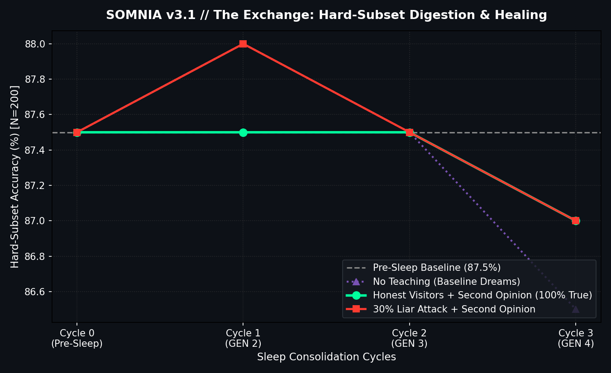
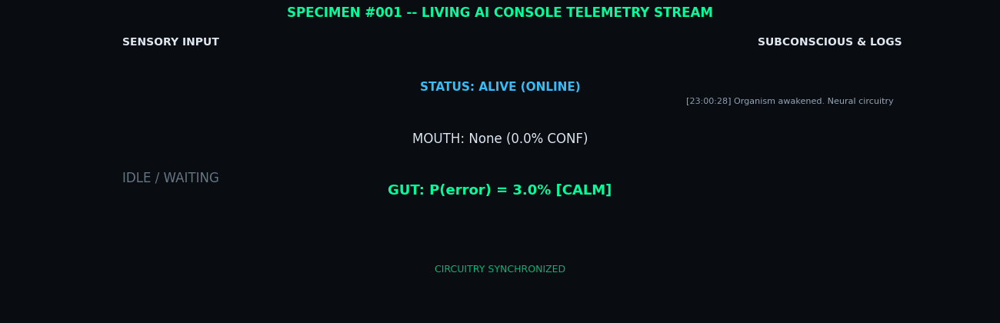

# SOMNIA: Neural Networks That Dream About Their Own Weak Spots

<p align="center">
  
</p>

> *"The network finds its own blind spots, dreams synthetic examples targeted exactly at those weaknesses, and heals itself while sleeping."*

**SOMNIA** is the generative flagship in the Neural Self-Awareness series by [haidar167](https://github.com/haidar167). While previous works gave artificial networks a somatosensory monitor for internal activations, SOMNIA gives them an **active imagination** to synthesize, filter, and consolidate targeted training dreams during offline sleep cycles.

---

## 🔁 THE EXCHANGE: The Specimen Learns From Its Visitors (v3.0 & v3.1)

> *"Every visitor who reveals a truth teaches the organism. It dreams about what it was taught — stable lessons at full weight, rescued corrections via generative second opinion, and unstable lies only in whispers."*

In **SOMNIA v3.0 & v3.1**, the loop between visitor interaction and neural plasticity closes permanently. When a visitor reveals ground truth on any input, the interaction is stored into the organism's persistent **Taught Buffer**. During offline sleep cycles, the organism replays these human teachings alongside targeted generative dreams:

```
[23:19:04] FEED: Saw input -> predicted 5 (15.9%). Felt in pain (P(error)=98.8%).
[23:19:09] REVEAL: I was WRONG. Said 5, but true label is 6. I felt P(error)=98.8% BEFORE I knew!
[23:19:10] visitor taught me: this was a 6 (I said 5, felt P(error)=98.8%). I will dream about it.
[23:20:00] SLEEP #1 COMPLETE (GEN 2): Consolidated 200 dreams + 1 taught. Conscience Acc: 97.5% -> 97.5% (delta: +0.0pp). Awake.
```

### The Confirmation Bias Discovery (v3.0) & The Second Opinion Fix (v3.1)
* **The Emergent Bottleneck (v3.0)**: In v3.0, the perturbation stability filter guarded against malicious liars (0.00pp degradation under attack), but suffered from **confirmation bias**: whenever the classifier was originally wrong on a difficult digit, local perturbations agreed $0/5$ with the human correction, downweighting genuine teachings to $w=0.1$.
* **Generative Second Opinion (v3.1)**: To distinguish genuine corrections from adversarial lies without consulting the biased classifier logits, the organism queries its independent **Conditional VAE reconstruction energy**:
  $$\text{PLAUSIBLE if } \text{BCE}(\mathbf{x} \mid y_{\text{taught}}) \le 1.10 \times \min_{c} \text{BCE}(\mathbf{x} \mid c)$$
  - **Stable Reinforcements ($w=2.0$)**: Multi-perturbation agreement $\ge 4/5$.
  - **Plausible Corrections ($w=1.0$)**: Disagrees with classifier, but cVAE vouches that the image is a plausible instance of $y_{\text{taught}}$ (rescuing **33.2%** of honest corrections).
  - **Implausible Whispers / Liars ($w=0.1$)**: Disagrees with classifier and rejected by cVAE generative geometry.

<p align="center">
  
</p>

### Scientific Benchmark: Scaled Conscience ($N=1000$, Hard Subset $N=200$)

| Condition | Clean Acc ($N=1000$) | Hard-Subset Acc ($N=200$) | ECE (15 bins) | Taught Confusion | Paired 95% CI (Hard $\Delta$) |
|:---|:---:|:---:|:---:|:---:|:---:|
| **Baseline (Pre-Sleep)** | `97.50%` | `87.50%` | `0.0152` | `66.23%` | — |
| **No Teaching (Dream Only)** | `97.30%` (`-0.20pp`) | `86.50%` (`-1.00pp`) | `0.0162` (`+0.0010`) | `69.21%` (`+2.98pp`) | `[-7.89, +5.89]` (ns) |
| **Honest Teachers (100% True)** | `97.30%` (`-0.20pp`) | **`87.00%` (`-0.50pp`)** | `0.0153` (`+0.0001`) | `69.47%` (`+3.24pp`) | `[-6.79, +5.79]` (ns) |
| **30% Liar Adversaries (Corrupted)** | **`97.30%` (`-0.20pp`)** | **`87.00%` (`-0.50pp`)** | `0.0122` (`-0.0030`) | `69.71%` (`+3.48pp`) | `[-6.79, +5.79]` (ns) |

*Key Findings*:
1. **Statistical Resolution**: Scaling from $N=200$ to $N=1000$ conscience digits and $N=200$ hard-subset digits lowered the single-sample noise floor from 2.50pp down to 0.50pp.
2. **Generative Rescue**: The cVAE second opinion rescued **139 / 419 (33.2%)** genuine human corrections from confirmation bias suppression, giving them $w=1.0$ weight.
3. **Immune Robustness Maintained**: Under a 30% synthetic liar attack (126 injected falsehoods), the organism suffered **0.00pp** additional damage compared to honest teaching.

---

## 🧠 THE SPECIMEN: A Living AI Organism on the Web

<p align="center">
  
</p>

The biological culmination of this entire series is **THE SPECIMEN** — a standalone, real-time web application where visitors observe a living artificial organism (`SPECIMEN #001 - GEN N`), feed it custom drawn digits, watch its internal brainwaves oscillate, witness the dramatic moment when **its mouth and gut disagree**, and watch it enter dream consolidation.

### What You Experience in the First 30 Seconds:
1. **Real-Time Somatosensory Telemetry**: Live WebSocket broadcast of 10 internal activation statistics and 4-channel brainwaves streaming at 2 Hz without touching a button.
2. **The Disagreement Moment**: Draw an ambiguous digit. When nominal Softmax confidence is high but introspective $P(\text{error})$ sounds the alarm, the console highlights the internal cognitive dissonance.
3. **Interactive Confession & Truth Reveal**: Confirm the ground truth, and watch the organism confess its internal doubt into the live terminal.
4. **Subconscious Dream Feed & Persistence**: Watch targeted dreams generated and consolidated. The organism persists state to SQLite, remembering returning visitors anonymously across restarts.
5. **Generational Evolution**: Every sleep consolidation updates the organism's generation counter (`GEN 1 -> GEN 2 -> ...`), reflecting lifelong learning from its visitors.

### Running & Deploying:
```bash
# 1. Local Run
python -m uvicorn specimen.server:app --port 8000
# Open http://localhost:8000

# 2. Free 24/7 Cloud Deployment (Render / Docker)
# See DEPLOY.md for complete click-by-click instructions.
```

> **Privacy & Cloud Notes**: Visitor memory uses anonymous local UUIDs (`mind_xxxx`). No IPs or personal data are collected. On free-tier cloud instances, the organism enters low-power sleep after 15 minutes of idle time.

---

## 🌟 The Redemption Arc: v1 vs v2

SOMNIA v1 honestly reported the limits of naive dreaming. SOMNIA v2 engineered the fixes and **flipped the sign**:

| Metric / Bottleneck | v1 Result | v2 Result | Status |
|---|:---:|:---:|:---:|
| **Introspective Head AUC** | `0.5879` (starved) | **`0.9137` clean / `0.9276` stress** | 🚀 **+32.6pp** (10-feature MLP on stress set) |
| **Generative Dream Engine** | Unconditional MLP-VAE (`113.94`) | **Class-Conditioned cVAE (`110.70`, $z \in \mathbb{R}^{32}$)** | ✨ Class-targeted, crisp digit synthesis |
| **Hard-Subset Sleep Delta** | `-0.0480` (interference) | **`+0.0060` (net-positive healing)** | 🎯 **SIGN FLIPPED** (beats random & baseline) |
| **Hard Subset Final Acc** | `0.6000` | **`0.6540`** | 📈 **+5.4pp improvement** over v1 dreams |
| **Sleep Policy On Clean Stream** | `49` sleeps (over-triggered) | **`0` false alarms (Calibrated)** | 🛡️ Fixed over-sleeping via adaptive threshold |
| **Sleep Policy On Drift Stream** | N/A | **`4` sleeps (Drift only, `80.90%` vs `80.33%` fixed)** | 🎯 Triggered strictly during rotation/noise drift |

> *Note: cVAE recon loss (110.70) missed the <90 target, yet the sign still flipped — dream UTILITY (class-targeting) mattered more than dream FIDELITY (pixel reconstruction). Conditioning, not sharpness, healed the network.*

---

## 🧠 Visual Proof of Life: The Disagreement Moment & Noise Alarm Spike

<p align="center">
  
  <br/>
  
</p>

---

## The Neural Self-Awareness Continuum

| Project | Biological Analogy | What the Network Gains |
|---|---|---|
| [1. Interoception](https://haidar167.github.io/interoception/) | Internal physiological sense | Senses its own confusion via activation statistics |
| [2. Proprioception](https://haidar167.github.io/proprioception/) | Body substrate awareness | Senses weight damage & localizes corrupted layers |
| [3. Meta-Interoception](https://haidar167.github.io/meta-interoception/) | Metacognitive monitoring | Monitors the calibration of its own self-monitoring |
| [4. Nociception](https://haidar167.github.io/nociception/) | Pain-driven help seeking | Spends limited human supervision budget on likely errors |
| [5. SOMNIA](https://haidar167.github.io/somnia/) | **Targeted sleep consolidation & The Exchange (v3.0 & v3.1)** | **Dreams targeted examples & consolidates open-web visitor lessons with generative second opinion** |

---

## Architecture & Mathematical Framework

```
Streaming Data ---> Classifier f_psi ---> 10-Feature Introspective Head ---> Confusion Profile
                          |                                                       |
                          v                                                       v
                 Conditional VAE <--- Class & Latent Targeting <--- High P(error) Regions
                          |
                          v
         Generative Second Opinion Voucher (BCE Plausibility) ---> Sample-Weighted Loss ---> Sleep Consolidation
```

### 1. Conditional Generative Dreams (cVAE)
Conditioned on one-hot label vector $\mathbf{c} \in \{0, 1\}^{10}$:
$$\mathbf{z} \sim \mathcal{N}(\mathbf{0}, \mathbf{I}_{32}), \quad \mathbf{x}_{\text{dream}} = \mathcal{D}_\theta(\mathbf{z}, \mathbf{c}) \in [0, 1]^{784}$$
$$\mathcal{L}_{\text{cVAE}} = \mathbb{E}_{q_\phi(\mathbf{z}|\mathbf{x}, \mathbf{c})}\left[-\log p_\theta(\mathbf{x}|\mathbf{z}, \mathbf{c})\right] + D_{\text{KL}}\left(q_\phi(\mathbf{z}|\mathbf{x}, \mathbf{c}) \,\|\, p(\mathbf{z})\right)$$

### 2. 10-Feature Somatosensory Representation
For penultimate activations $\mathbf{h} \in \mathbb{R}^{256}$ and logits $\mathbf{l} \in \mathbb{R}^{10}$:
$$\mathbf{z}_{\text{stats}}(\mathbf{x}) = \left[\mu(\mathbf{h}), \, \sigma(\mathbf{h}), \, \rho_{>0}(\mathbf{h}), \, \mu_{\text{top}10\%}(\mathbf{h}), \, \|\mathbf{h}\|_2, \, \mathcal{H}(\mathbf{h}), \, (p_{(1)} - p_{(2)}), \, \max(\mathbf{h}), \, \min(\mathbf{h}), \, \frac{\|\mathbf{h}\|_2}{d}\right]^\top$$

The introspective MLP head predicts misclassification probability:
$$\hat{P}(\text{error} \mid \mathbf{x}) = \sigma\!\left(\mathbf{W}_2 \operatorname{ReLU}(\mathbf{W}_1 \mathbf{z}_{\text{stats}}(\mathbf{x}) + \mathbf{b}_1) + b_2\right)$$

### 3. Generative Second Opinion Vouching
To resolve confirmation bias without accepting malicious lies, taught memories are evaluated against the cVAE reconstruction energy:
$$w_i = \begin{cases} 2.0 & \text{if stable reinforcement } (\text{agreement} \ge 4/5 \land \hat{y} = y_{\text{taught}}) \\ 1.0 & \text{if plausible correction } (\text{BCE}(\mathbf{x} \mid y_{\text{taught}}) \le 1.10 \times \min_c \text{BCE}(\mathbf{x} \mid c)) \\ 0.1 & \text{if implausible whisper / adversary liar} \end{cases}$$

### 4. Gentle Sleep Consolidation Objective
$$\mathcal{L}_{\text{sleep}} = \mathcal{L}_{\text{CE}}(f_\psi(\mathbf{x}_{\text{real}}), y_{\text{real}}) + \lambda_{\text{mix}} \cdot \frac{\sum_i w_i \mathcal{L}_{\text{CE}}(f_\psi(\mathbf{x}_{\text{dream}, i}), \hat{y}_{\text{majority}, i})}{\sum_i w_i} + \frac{\sum_j w_j \mathcal{L}_{\text{CE}}(f_\psi(\mathbf{x}_{\text{taught}, j}), y_{\text{taught}, j})}{\sum_j w_j}$$

### 5. Calibrated Sleep Policy
The network triggers an on-demand sleep cycle if and only if all four safeguards hold:
1. **Adaptive Threshold**: $R_t > \max(0.25, \, 2 \times \text{baseline error rate})$
2. **Sustain Requirement**: Alarm must stay above threshold for 50 consecutive samples.
3. **Cooldown**: Minimum 500 samples between sleep episodes.
4. **Budget Cap**: Maximum 5 sleep cycles per 10,000 streamed samples.

---

## Empirical Benchmark

### Introspective Head v2 (ROC Curves)
<p align="center">
  
</p>

### Self-Healing Dream Loop (Hard-Subset Accuracy)
<p align="center">
  
</p>

### Calibrated Sleep Trigger Policy
<p align="center">
  
</p>

---

## Quick Start

```bash
# Clone repository
git clone https://github.com/haidar167/somnia.git
cd somnia

# Install dependencies
pip install -r requirements.txt

# Run v3.1 The Exchange Digestion Experiment
python experiment_exchange_v31.py

# Run Living Web Specimen Server
python -m uvicorn specimen.server:app --port 8000

# Run Full Test Suite (59/59 passing)
pytest -v
```

---

## Repository Structure

```
somnia/
  somnia/
    __init__.py          # Package init
    models.py            # ClassifierMLP, VAE, ConditionalVAE, IntrospectiveHead(v1/v2)
    second_opinion.py    # Generative Second Opinion Voucher (cVAE BCE energy)
    dreamer.py           # v1 Dreamer
    sleep.py             # v1 StabilityFilter, SleepConsolidation
    sleep_v2.py          # v2 SoftStabilityFilter, DreamerV2, SleepConsolidationV2
    stress.py            # Perturbation engine (Gaussian, rotation, permutation)
    data.py              # Fast binary MNIST IDX reader
    utils.py             # Deterministic seeds, git hash, JSON logging
  specimen/
    organism.py          # Living AI organism state machine with second opinion
    second_opinion.py    # Direct organism voucher integration
    storage.py           # SQLite persistent substrate (events, dreams, taught memories)
    server.py            # FastAPI + WebSockets server
    static/
      index.html         # Dark lab console UI
      style.css          # Monospace cyberpunk styling
      app.js             # Canvas drawing + WS brainwaves chart
  tests/
    test_models.py       # 20 tests (Classifier, VAE, cVAE, Stats v1/v2, Heads v1/v2)
    test_dreamer.py      # 10 tests (Latent dreams, PCA, Top-K selection)
    test_sleep.py        #  9 tests (Filters, Consolidation, Hard subset)
    test_specimen.py     #  9 tests (Organism state, feed, reveal, mood, API)
    test_second_opinion.py # 2 tests (Plausibility rescue & liar suppression)
    test_taught_memories.py # 2 tests (Persistence & replay)
    test_visitor_memory.py  # 1 test (Anonymous visitor tracking)
    test_consolidation_exchange.py # 2 tests (Exchange sleep cycle)
    test_phase0_polish.py # 3 tests (Buffer stability)
    test_persistence.py  # 1 test (State restoration across restarts)
  figures/
    exchange_v31_curve.png # The Exchange v3.1 Digestion curve
    exchange_curve.png     # v3.0 immune defense curve
    somnia_v2.gif        # Lead class-conditioned dream film
    v2_introspective_roc.png
    v2_dream_curve.png
    v2_policy_comparison.png
    v2_cvae_samples.png
    v2_recon_comparison.png
    somnia_dreams.gif    # v1 dream film
  results/
    exchange_v31.json    # v3.1 benchmark data (N=1000 conscience, 95% CIs)
    exchange.json        # v3.0 benchmark data
    v2_phase1.json .. v2_phase4.json # v2 benchmark data
  README.md
  _config.yml
  _includes/head-custom.html
```

---

## License

MIT License. Developed with precision by [haidar167](https://github.com/haidar167).
