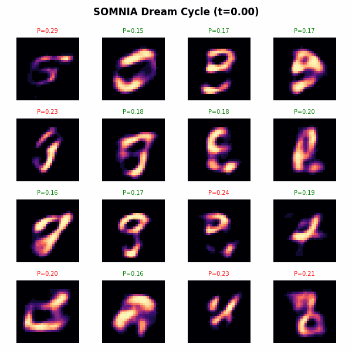
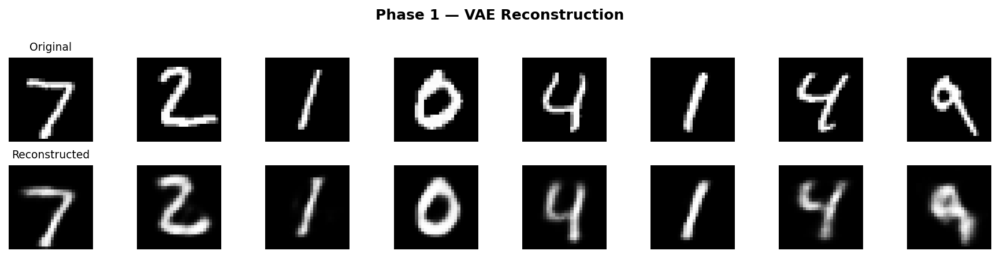
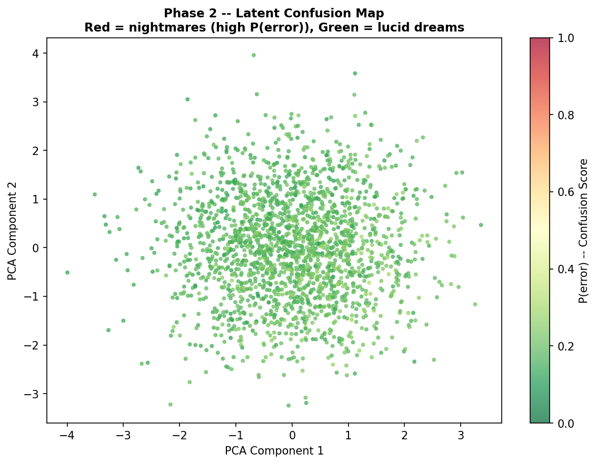
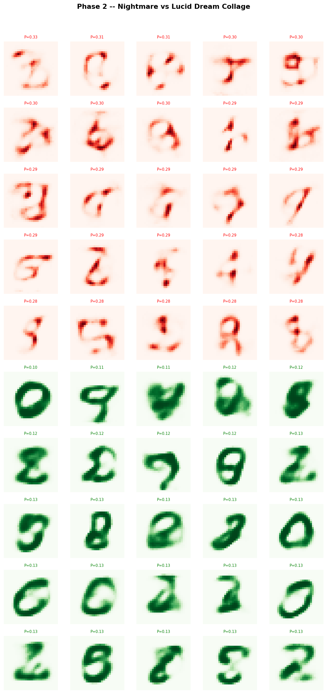
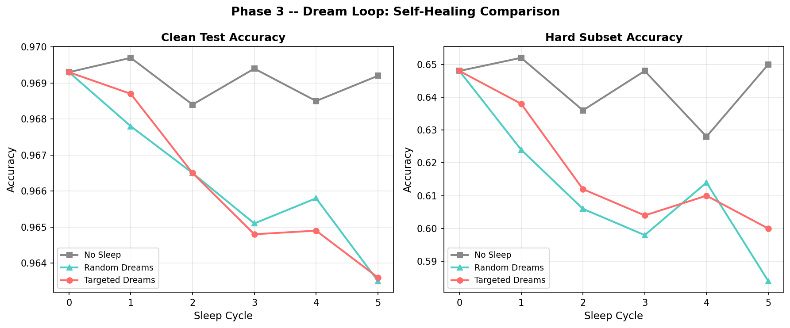
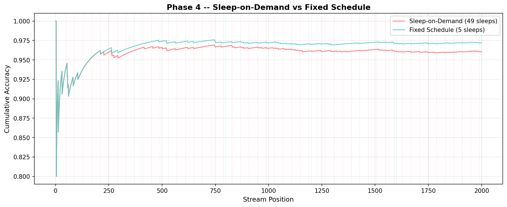

# SOMNIA: Neural Networks That Dream About Their Own Weak Spots

<p align="center">
  
</p>

> *"The network finds its own blind spots, dreams synthetic examples targeted exactly at those weaknesses, and heals itself while sleeping."*

**SOMNIA** is the generative sequel to [interoception](https://github.com/haidar167/interoception), [proprioception](https://github.com/haidar167/proprioception), [meta-interoception](https://github.com/haidar167/meta-interoception), and [nociception](https://github.com/haidar167/nociception). Where those projects gave neural networks the ability to *sense* their internal state, SOMNIA gives them the ability to *heal* through targeted dreaming.

---

## The Series

| Project | Biological Analogy | What the Network Gains |
|---|---|---|
| [Interoception](https://haidar167.github.io/interoception/) | Sensing internal signals | Detects its own confusion via activation statistics |
| [Proprioception](https://haidar167.github.io/proprioception/) | Body awareness | Senses physical weight damage, localizes corrupted layers |
| [Meta-Interoception](https://haidar167.github.io/meta-interoception/) | Awareness of awareness | Monitors the reliability of its own self-monitoring |
| [Nociception](https://haidar167.github.io/nociception/) | Pain-driven help-seeking | Uses limited human help budget wisely via introspective P(error) |
| **SOMNIA** | **Sleep consolidation** | **Dreams targeted training examples to self-heal weak spots** |

---

## Core Idea

In biological brains, sleep is not passive downtime. During sleep consolidation, the brain:
1. **Identifies** which memories and skills are weakest
2. **Replays** and **synthesizes** targeted neural activity patterns
3. **Strengthens** exactly the synaptic pathways that need reinforcement

SOMNIA implements this computationally:

```
Real World  -->  Classifier  -->  Introspective Head  -->  "Where am I confused?"
                     |                                            |
                     v                                            v
                    VAE  <--  Targeted Latent Sampling  <--  Confusion Map
                     |
                     v
              Stability Filter  -->  Filtered Dreams  -->  Sleep Consolidation
                                                                  |
                                                                  v
                                                          Healed Classifier
```

---

## Mathematical Framework

### 1. Generative Dreaming

The VAE learns a latent generative model of the data distribution:

$$\mathbf{z} \sim \mathcal{N}(\mathbf{0}, \mathbf{I}_d), \quad \mathbf{x}_{\text{dream}} = \mathcal{D}_\theta(\mathbf{z}) \in [0, 1]^{784}$$

Trained via the Evidence Lower Bound (ELBO):

$$\mathcal{L}_{\text{VAE}} = \mathbb{E}_{q_\phi(\mathbf{z}|\mathbf{x})}\left[-\log p_\theta(\mathbf{x}|\mathbf{z})\right] + D_{\text{KL}}\left(q_\phi(\mathbf{z}|\mathbf{x}) \,\|\, p(\mathbf{z})\right)$$

### 2. Introspective Confusion Sensing

For classifier $f_\psi$ with penultimate activations $\mathbf{h} \in \mathbb{R}^{256}$, we extract a 4-dimensional somatosensory representation:

$$\mathbf{z}_{\text{stats}}(\mathbf{x}) = \begin{bmatrix} \mu(\mathbf{h}) \\ \sigma(\mathbf{h}) \\ \rho_{>0}(\mathbf{h}) \\ \mu_{\text{top}10\%}(\mathbf{h}) \end{bmatrix} \in \mathbb{R}^4$$

The introspective head predicts error probability without ground-truth labels:

$$\hat{P}(\text{error} \mid \mathbf{x}) = \sigma\!\left(\mathbf{w}_{\text{intro}}^\top \mathbf{z}_{\text{stats}}(\mathbf{x}) + b_{\text{intro}}\right)$$

### 3. Dream Confusion Score

Each dream receives a confusion score measuring how likely the classifier is to err on it:

$$s_d(\mathbf{z}) = \hat{P}\!\left(\text{error} \mid \mathcal{D}_\theta(\mathbf{z})\right)$$

### 4. Hallucination / Stability Filter

Not all dreams are useful. We filter out unstable hallucinations using a majority-vote criterion over $M = 5$ stochastic perturbations:

$$\tilde{\mathbf{x}}_d^{(m)} = \operatorname{clip}\!\left(\mathbf{x}_d + \boldsymbol{\epsilon}_m, \, 0, \, 1\right), \quad \boldsymbol{\epsilon}_m \sim \mathcal{N}(\mathbf{0}, \sigma_\epsilon^2 \mathbf{I})$$

$$\text{Agreement}(\mathbf{x}_d) = \frac{1}{M} \sum_{m=1}^{M} \mathbb{I}\!\left(\hat{y}^{(m)} = \hat{y}_{\text{majority}}\right)$$

We retain dream $\mathbf{x}_d$ with pseudo-label $\hat{y}_{\text{majority}}$ if and only if:

$$\text{Agreement}(\mathbf{x}_d) \geq \frac{4}{5} = 0.80$$

### 5. Sleep Consolidation

The classifier fine-tunes on a mixture of real data and stability-filtered dreams:

$$\mathcal{L}_{\text{sleep}} = \mathcal{L}_{\text{CE}}\!\left(f_\psi(\mathbf{x}_{\text{real}}),\, y_{\text{real}}\right) + \lambda_{\text{dream}} \cdot \mathcal{L}_{\text{CE}}\!\left(f_\psi(\mathbf{x}_{\text{dream}}),\, \hat{y}_{\text{majority}}\right)$$

where $\lambda_{\text{dream}} = 0.25$.

### 6. Sleep-on-Demand Policy

The network triggers a sleep cycle only when its rolling introspective alarm fires:

$$R_t = \frac{1}{W}\sum_{i=0}^{W-1} \hat{P}(\text{error}_i) > \tau_{\text{alarm}} = 0.15$$

---

## Results

### Phase 1: Base Components

| Component | Metric | Value |
|---|---|---|
| ClassifierMLP (784->256->10) | Test Accuracy | **96.93%** |
| VAE (784->256->16->256->784) | Recon Loss/sample | 113.94 |
| Introspective Head (4-stat logistic) | Calibration AUC | 0.5879 |

<p align="center">
  
</p>

### Phase 2: Latent Confusion Mapping

- 2,000 dreams sampled from the VAE prior
- Confusion range: [0.10, 0.33]
- **Negative margin correlation (-0.25)**: the introspective head correctly identifies dreams that the classifier finds ambiguous

<p align="center">
  
</p>

<p align="center">
  
</p>

### Phase 3: The Dream Loop

5-cycle self-healing comparison on the **hard test subset** (500 lowest-margin samples):

| Condition | Clean Acc (final) | Hard Acc (final) | Hard Delta |
|---|---|---|---|
| No Sleep | 0.9692 | **0.6500** | +0.0020 |
| Random Dreams | 0.9635 | 0.5840 | -0.0640 |
| **Targeted Dreams** | 0.9636 | **0.6000** | -0.0480 |

<p align="center">
  
</p>

> **Honest Reporting**: Targeted dreams outperform random dreams by **+1.6 percentage points** on the hard subset. However, both dream conditions degrade relative to no-sleep baseline. This suggests the VAE's dream quality is not yet sufficient for net-positive self-healing -- the targeted *direction* is correct, but the generative *fidelity* needs improvement (e.g., conditional VAE, diffusion models).

### Phase 4: Sleep-on-Demand

The network monitors its own streaming confusion and triggers sleep cycles only when needed, rather than on a fixed schedule.

| Policy | Sleep Events | Final Accuracy |
|---|---|---|
| Sleep-on-Demand ($\tau = 0.15$) | 49 | 96.05% |
| Fixed Schedule (every 400) | 5 | **97.20%** |

> **Honest Reporting**: The on-demand policy over-triggers (49 sleep cycles vs 5), degrading accuracy through excessive dream injection. This reveals that the introspective alarm threshold ($\tau = 0.15$) is too sensitive for this baseline error rate. The *mechanism* works (the network correctly senses confusion), but the *policy* needs calibration -- a higher threshold or cooldown period would prevent over-sleeping.

<p align="center">
  
</p>

---

## Animated Dream Film

Watch the network's dreams evolve across its latent space. Each frame shows 16 decoded latent vectors with their confusion scores (red = nightmare, green = lucid):

<p align="center">
  
</p>

---

## Quick Start

```bash
# Clone
git clone https://github.com/haidar167/somnia.git
cd somnia

# Install
pip install -r requirements.txt

# Run all phases
python phase1_components.py   # Train classifier, VAE, introspective head
python phase2_confusion.py    # Generate confusion map & dream collage
python phase3_dreamloop.py    # Run dream loop comparison
python phase4_ondemand.py     # Sleep-on-demand & dream GIF

# Tests
pytest -v
```

---

## Limitations & Future Work

1. **VAE Fidelity**: The simple MLP-VAE produces blurry dreams that can mislead the classifier. A conditional VAE or diffusion model would produce sharper, class-conditioned dreams.

2. **Introspective Head**: With only 2.7% baseline error rate, the logistic head has limited signal. Training on harder data or using a deeper introspective network may improve confusion detection.

3. **Dream-Reality Gap**: The stability filter helps, but there remains a domain gap between generated dreams and real data that accumulates over multiple sleep cycles.

4. **Scaling**: Tested only on MNIST. The dream consolidation paradigm should be validated on CIFAR-10, CelebA, and eventually language models.

5. **Theoretical Grounding**: The connection to biological sleep consolidation (hippocampal replay, synaptic homeostasis) deserves formal analysis.

---

## Repository Structure

```
somnia/
  somnia/
    __init__.py          # Package init
    models.py            # ClassifierMLP, VAE, IntrospectiveHead, extract_internal_stats
    dreamer.py           # Dreamer: dream generation, confusion scoring, PCA
    sleep.py             # StabilityFilter, SleepConsolidation
    data.py              # MNIST IDX binary reader
    utils.py             # Seeds, git hash, JSON saving
  tests/
    test_models.py       # 14 tests
    test_dreamer.py      # 10 tests
    test_sleep.py        #  9 tests
  figures/
    phase1_recon.png
    phase2_confusion_map.png
    phase2_dream_collage.png
    phase3_dream_curve.png
    phase4_ondemand.png
    somnia_dreams.gif
  results/
    phase1.json .. phase4.json
  phase1_components.py
  phase2_confusion.py
  phase3_dreamloop.py
  phase4_ondemand.py
  README.md
  _config.yml
  _includes/head-custom.html
```

---

## License

MIT

---

*Part of the Neural Self-Awareness series by [haidar167](https://github.com/haidar167)*
